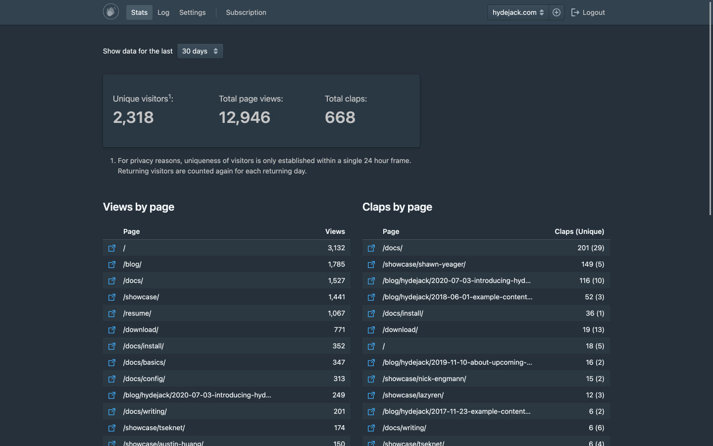

# Clap Button

* Table of Contents
{:toc .large-only}

## Privacy-Preserving Analytics

<p><clap-button url="#privacy-preserving-analytics" text-placement="bottom" nowave></clap-button></p>

Clap Button doubles as a privacy-friendly analytics solution. 
It track pages, not people.

Unlike other analytics solutions, Clap Button also gives you insights along a second dimension: 
Claps, an anonymous, self-selected score of which parts users _love_.


<!-- ## Built-In Spam Protection
{:.mt4}

<clap-button url="#built-in-spam-protection" text-placement="bottom" nowave></clap-button>

Clap button uses a simple _Proof of Work_ algorithm to add an additional barrier to automated scripts attempting to manipulate your clap scores. -->

## Cookie Clicker-like Engagement

<p><clap-button url="#cookie-clicker-like-engagement" text-placement="bottom" nowave></clap-button></p>

Clap Button improves your SEO ranking by keeping users engaged on your site. 

The component is designed to draw attention and keeps visitors active with it's Cookie Clicker[^1]-like mechanics,
which are exploiting the fact that clicking something repeatedly is oddly satisfying.


## Living on the Edge

<p><clap-button url="#living-on-the-edge" text-placement="bottom" nowave></clap-button></p>

Clap Button is built on fully managed, globally distributed infrastructure. 
Response times are fast and it scales automatically to any load. 

***

## Zero-Config Example

<p><clap-button url="#zero-config-example" text-placement="bottom" nowave></clap-button></p>

The clap button is a custom element that can be added directly to the page. Here is a minimal example:

The example only works if your site is hosted on __localhost__ or with an [active subscription](#pricing) otherwise.
{:.note.smaller.mb2}

```html
<head>
  <script type="module" src="https://unpkg.com/@getclaps/button"></script>
</head>
<body>
  <clap-button></clap-button>
</body>
```
{:.larger}

This will render the following button:

<clap-button></clap-button>

## Pricing

<p><clap-button url="#pricing" text-placement="bottom" nowave></clap-button></p>

The Clap Button backend service is __$5.00 per month__ per origin for early-adopters. 
Currently, this is limited to 25,000 views per month. Higher tier plans will be added on demand.

After you've completed the payment you'll be taken to your dashboard, where you'll be able to enter your domain. 
After this step, `<clap-button/>` will work immediately on your site. 



_Note that the Clap Button Dashboard is work in progress._
_You can view relevant information and manage your subscription._
_However, it is not looking super-pretty right now. See screenshot below:_
{:.note title="Important" style="margin-bottom:2rem"} 

<picture>
  <source srcset="assets/img/dashl.jpg" media="(prefers-color-scheme: dark)">
  
</picture>

The Clap Button Dashboard
{:.figcaption}


## Limitations

<p><clap-button url="#limitations" text-placement="bottom" nowave></clap-button></p>

Currently, usage it limited to smaller to medium-sized websites. 
The infrastructure supports much higher volumes, but metering is not implemented yet. 
[Please contact me](mailto:getclaps@qwtel.com) if that's something you're interested in.

<!-- Don't feel like typing an email to a human? [Subscribe to our newsletter](#subscribe) instead and get informed when high-volume plans arrive.
{:.note.smaller.mb2 title="Hey there!"} -->

Views per month
: 25,000

Dashboards per subscription
: 1

Pages per domain
: 10,000

Fragments per URL (e.g. `/path#fragment`)
: 64


## Close To Open Source

<p><clap-button url="#close-to-open-source" text-placement="bottom" nowave></clap-button></p>

The web component and core of the backend are open sourced under [AGPL-3.0](licenses/AGPL-3.0.md) and can be used within the limits of this license.

Only the database layer and billing module remain closed source. You are free to provide your own implementation of the Data Access Objected based on the [public interface](https://github.com/getclaps/worker/blob/master/src/dao.ts), or use a community-provided implementation.

<!-- ## Config Example
{:.mt4}

Zero-Config doesn't mean no config is possible: Make it your own with the following options:

```html
<clap-button 
  url="#config-example" 
  text-placement="bottom" 
  style="--clap-button-color: gray"
  nowave 
></clap-button>
```
{:.larger}

<clap-button url="#config-example" text-placement="bottom" nowave style="--clap-button-color: gray"></clap-button> -->


[^1]: [Cookie Clicker](http://orteil.dashnet.org/cookieclicker/) is a popular online game that pioneered the "clicker" genre, where the main mechanic is clicking a single button. Much like clap buttons, it's using the fact that clicking something repeatedly is oddly satisfying.

[^2]: Note that claps will be deleted after 24 hours when they are hosted on localhost.


<style>
  .page > p { position: relative }
  .page > hr { margin: 4rem 0 }
  h1, h2, h3, .h1, .h2, .h3 { margin-top: 4rem }
  h4, h5, h6, .h4, .h5, .h6 { margin-top: 3rem }

  p code {
    display: inline-block;
    margin-left: -.5em;
  }

  @media (prefers-color-scheme: dark) { .lm-only { display: none!important } }
  @media (prefers-color-scheme: light) { .dm-only { display: none!important } }
  .dark-mode .lm-only { display: none!important }
  .dark-mode .dm-only { display: unset!important }
  .light-mode .dm-only { display: none!important }
  .light-mode .lm-only { display: unset!important }
</style>